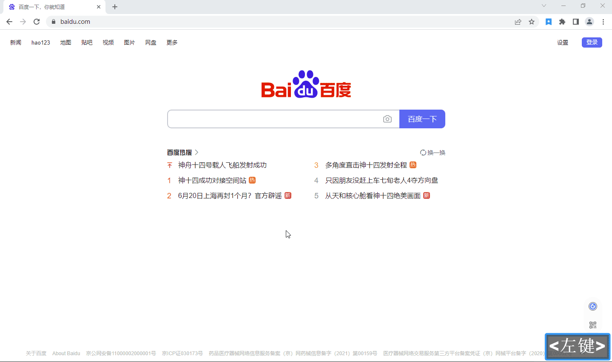

## 项目介绍

简单书签 - 一个无压的浏览器书签管理扩展

## 相关地址

[chrome 网上应用商店](https://chrome.google.com/webstore/detail/%E7%AE%80%E5%8D%95%E4%B9%A6%E7%AD%BE/eepoajjgnajliplcimelcklkaobndkkm?hl=zh-CN&authuser=0) （自备梯子）

Edge 外接程序

[GitHub 源码](https://github.com/NMTuan/ezBookmarks)

## 开发背景

近几年双链笔记的兴起，让我感受到了无压记录的魅力。一直在考虑如何把浏览器的书签整合到笔记中，曾经基于思源笔记的 api 尝试写过一个[浏览器扩展](https://github.com/NMTuan/sy_bookmarks)，但最终因为形态模糊目标不清晰，再没有继续下去。

简单书签放弃了`all in one`的执念，锁定**无压**这个概念，让书签的使用不再有心智负担。

## 功能特色

- **云端同步**：所有数据均保存于腾讯云（cloudBase），保证多浏览器数据一致。

- **私有接入**: 除了本扩展提供的公共同步服务外, 还可以接入自己的腾讯云实例。

- **数据唯一**：保证 url 地址唯一，一个 url 地址只会产生一条数据。

- **无压添加**：使用`标签`替代`文件夹`的概念，添加书签`（alt+d）`不需要思考存放位置。

- **无压使用**：通过快速搜索`（alt+f）`寻找书签。

## 界面预览

[查看动图](./other/humb.gif)

## 技术架构

本项目基于以下技术开发：

`svelte.js` `vite.js` `tailwind.css` `cloudbase`

本项目完全开源，可访问[GitHub](https://github.com/NMTuan/ezBookmarks)查看。

由于 svelte/vite/cloudbase 都是边学边做，代码质量不高，见谅。

## 使用方法

1. 选择合适的市场（chrome | edge），安装此扩展。

2. 打开浏览器扩展的[快捷键设置界面](chrome://extensions/shortcuts)，设置一个您习惯的快捷键。

3. 打开扩展的选项页面，进入到登录界面。

4. 切换至注册表单，使用您常用的邮箱进行注册，提交后会收到一封激活邮件。

5. 找到激活邮件，点击激活链接完成注册流程。

6. 回到选项页面，输入邮箱密码即可登录。

7. 按照您设定好的快捷键，无压的使用吧。

## 私有接入

目前，`简单书签`最大的书签保存数量为 500 条/帐号，如果您需要更大的存储，可以考虑接入自己的腾讯云实例。

1. 开通云开发环境，详见[官方文档](https://docs.cloudbase.net/quick-start/create-env)。记录您创建的实例 ID。

2. 设置登录鉴权，开启并配置`邮箱登录`，建议选择 QQ 邮箱，方便快捷。

3. 创建数据库，新建数据库集合，建议取名为`bookmarks`。集合权限设置为`仅创建者及管理员可读写`即可。

4. 参见上面的`使用方法`安装此扩展，并打开扩展的选项页面。在登录窗的右上角点击`小齿轮`进入设置界面，填写实例 ID 和数据库集合名称后保存。

5. 参见上面的`使用方法`注册并登录即可。

## 构建方法

如果你希望构建自己的`简单书签`，只需要克隆本仓库，简单配置一下即可创建属于您自己的简单书签。

**注意**：与`私有接入`一样，你需要准备好腾讯云开发实例；同时需要您有 git 基础和 nodejs 基础。

1. `git clone`本仓库。

2. 打开`./config.js`文件，配置云开发实例 ID。

3. 命令行执行`npm install`或者`yarn`构建依赖。

4. 命令行执行`npm run build`或者`yarn build`打包。

5. 打开浏览器的[扩展页面](chrome://extensions/)，开启`开发者模式`，选择`加载已解压的扩展程序`，选择`./dist`文件夹即可。

6. 参考上面的`使用方法`注册并登录即可。

## 支持一下

如果该项目对您有所帮助，欢迎前往[Star](https://github.com/NMTuan/ezBookmarks)该项目。

或者前往[面包多]()支持一个。

也可以直接扫码，让我给主子买个罐头。

## 版权

[License MIT](./LICENSE)
